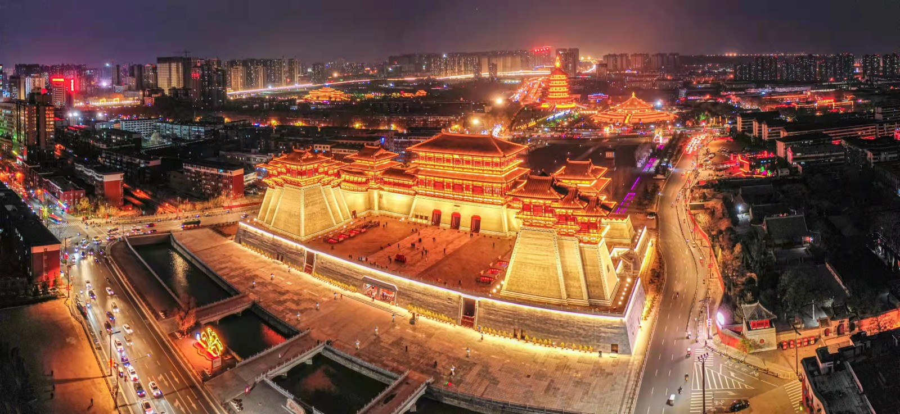
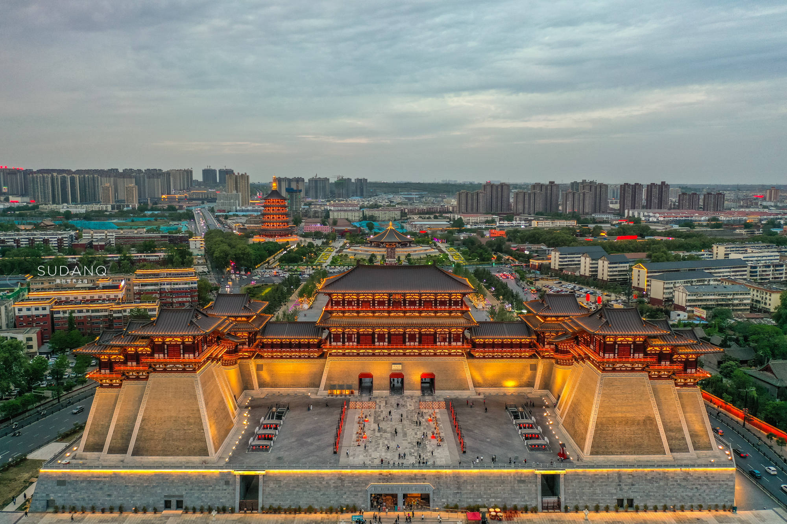
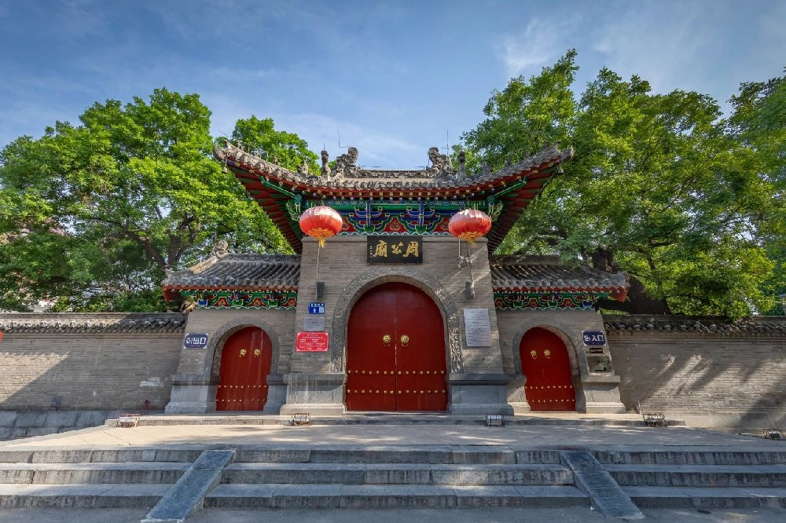
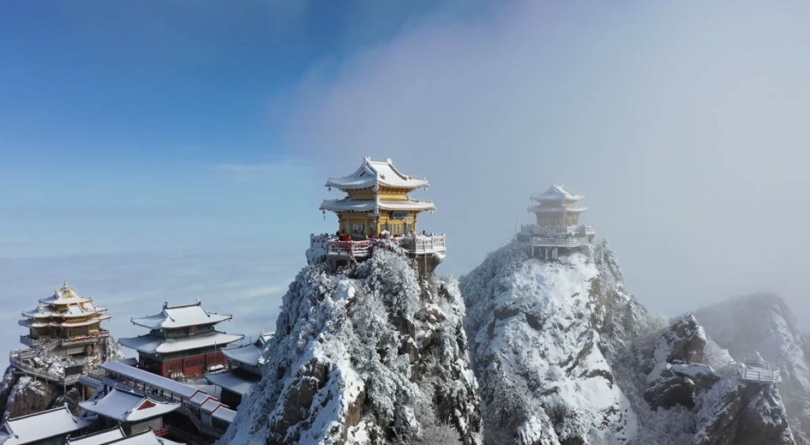
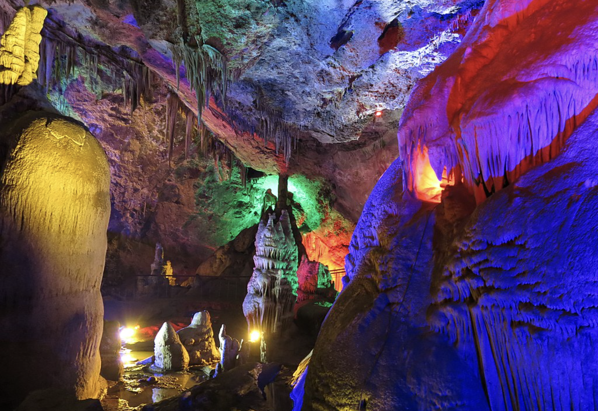
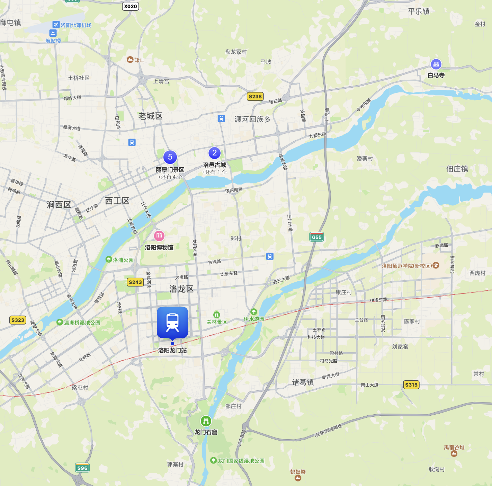
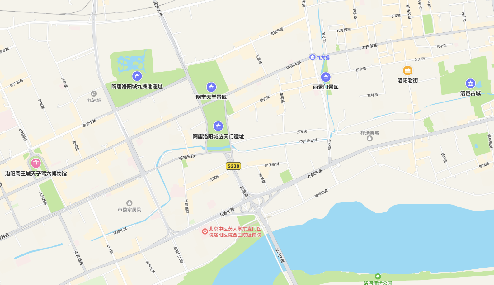

# 洛阳

## 景点

- 龙门石窟
  - 龙门石窟是中国三大石刻艺术宝库之一，同时被誉为世界最伟大的古典艺术宝库之一，与甘肃敦煌莫高窟、山西大同云岗石窟等中国著名石窟列为世界文化遗产。
  - 龙门由大禹治水中所开凿，鱼跃龙门的传说亦发生于此。其石窟始凿于北魏孝文帝年间，盛于唐，终于清末，历经10多个朝代陆续营造长达1400余年，是世界上营造时间最长的石窟之一，现存洞窟像龛2345个，造像11万余尊。
  - 龙门石窟造像多为皇家贵族所建，是世界上绝无仅有的皇家石窟。主要有武则天根据自己的容貌雕刻的卢舍那大佛、孝文帝为冯太后凿古阳洞、兰陵王孙于万佛洞造像、李泰为长孙皇后造宾阳南洞、韦贵妃凿敬善寺、高力士为唐玄宗造无量寿佛等。又经历天竺、新罗、吐火罗、康国等外国人开窟造像，发现有欧洲纹样、古希腊石柱等，堪称全世界国际化水平最高的石窟。
    

- 隋唐洛阳城
  - 隋唐洛阳城始建于隋炀帝大业元年（公元605年），盛于唐朝，特别是女皇武则天统治时期，距今已有1400多年历史，历史文化价值深厚。它曾是中国隋代大运河中心、丝绸之路的东方起点，拥有成熟的洛南里坊制度，宏伟壮观的城市中轴线和星罗棋布的名人园林。
    

- 隋唐洛阳城-应天门
  - 应天门始建于隋大业元年（605年），原名则天门，神龙元年（705年）避武则天讳改称应天门，是朝廷举行登基、改元、大赦、宴会等外朝大典的场所。
  - 应天门是中国古代规格最高的城门，其建制对北宋汴梁宣德门、元大都崇天门、明清故宫的午门影响深远，名称更被日本京都·应天门取用，被誉为“隋唐第一门”，有“天下第一门”之称，在中国宫城建筑史上占有重要地位。
    

- 隋唐洛阳城-明堂天堂
  - 明堂天堂景区，修建在紫微城遗址的核心区域，是隋唐洛阳城项目最为重要的景观，是昔日女皇武则天理政、礼佛、生活的重要场所。
  - 明堂是唐洛阳紫微城正殿，号称“万象神宫”，天堂是武则天的御用礼佛堂，号称“通天浮屠”。
    

- 隋唐洛阳城-九洲池
  - 九洲池是隋唐洛阳城·宫城——紫微城内重要的皇家池苑，荟萃了唐宋园林建筑艺术的精华，是中国古代皇家园林的杰出典范。
    

- 丽景门
  - 今日的丽景门是市政府在金元明清时期的丽景门原址重建的一座重现古都洛阳风貌的城楼。
  - 整个丽景门景区由城门楼、瓮城、箭楼、城墙和丽景桥（古时为吊桥），护城河等部分组成，其城垣高厚，月城宏阔，重门叠关，上干浮云，气势磅礴。
    

- 洛阳老街
  - 老街文化形成于金中京，是在隋唐东都的东城旧址上兴建的，距今已有三千多年的历史。
  - 洛阳老街保存着原始的面貌，往来的人群，吆喝叫卖的小贩和两旁林立的商铺，处处充满了古都的味道。
    

- 洛阳博物馆
  - 洛阳博物馆位于城市的中轴线上，采用"鼎立天下"的设计理念，整体建筑外观为大鼎造型。
  - 博物馆展出文物1.1万余件。以河洛文化为主体，收藏上起仰韶文化、龙山文化和夏商时期、下至明清、民国的文物，朝代跨度在国内地级市博物馆中首屈一指。
    

- 周公庙博物馆
  - 洛阳周公庙博物馆是在洛阳周公庙的基础上建立的一座弘扬周公文化、展示周公史迹的专题博物馆。始建于隋末唐初，是祭祀周公的祠庙，亦称元圣庙。
    

- 天子驾六博物馆
  - 以东周王城遗址出土的“天子驾六”车马坑命名，是一座以原址保护展示的东周时期大型车马坑为主体，辅展以东周王城概况、王陵考古的新发现及部分东周时期珍贵文物的“王城、王陵、王器”专题博物馆。
    

- 关林庙
  - 为埋葬三国时蜀将关羽首级之地，前为祠庙，后为墓冢，为海内外三大关庙之一，千百座关庙中独称“林”，是中国唯有的冢、庙、林三祀合一的古代经典建筑。
    

- 洛邑古城
  - 洛邑古城由“洛阳文峰塔非遗文化产业园”改建而来，景区并以唐、宋、元、明、清、民国各时期建筑风格为建设主基调，以历史文化为基础结合旅游、餐饮、住宿、娱乐等综合业态，综合建设成为集文化、旅游、商业、休闲、度假为一体的历史文化古城。
    

- 白马寺
  - 白马寺创建于东汉，是佛教传入中国后的第一座寺院，白马寺建立之后，中国“僧院”便泛称为“寺”，白马寺也因此被认为是中国佛教的发源地，有中国佛教的“祖庭”和“释源”之称。
  - 汉明帝派人去天竺寻找佛法。他们在西域遇到了天竺的僧人，得佛经佛像，相偕同行，以白马驮经，返回京城洛阳。汉明帝为高僧建造了一个天竺风格的建筑群，用作居住和翻译经书的地方，以僧人们暂住的“鸿胪寺”的“寺”字称之，为了纪念白马驮经之功，便命名为“白马寺”。
  - 寺内保存了大量元代夹纻干漆造像如三世佛、二天将、十八罗汉等，弥足珍贵。
    

- 老君山
  - “天下无双圣境，世界第一仙山”。老君山古号“景室山”，取八百里伏牛山美景集于一室之意，。
  - 春秋时期，道教始祖老子李耳到此归隐修炼，使之成为“道源”和“祖庭”。北魏始于其上建老君庙以纪念。唐太宗重修景室山铁顶老君庙，赐名“老君山”，成为道教主流全真派圣地。明神宗诏谕老君山为“天下名山”，并发帑金建殿，成为历史上唯一被皇封为“天下名山”的中国山脉。
    

- 鸡冠洞
  - 位于洛阳市栾川县，县城西三公里，秦岭余脉伏牛山支脉鸡冠山的半山腰上，是一处大型的石灰岩溶洞，属于喀斯特岩溶地貌。
    

## 路线参考

### 景点位置

### Day0

- 早上：坐高铁道德洛阳龙门站
- 下午：龙门石窟
- 晚上：应天门

### Day1

- 上午：天子驾六博物馆
- 下午：洛阳博物馆
- 晚上：天堂明堂 - 丽景门 - 洛阳老街

### Day2

- 上午：白马寺
- 下午：洛邑古城
- 晚上：九州池

### Day3

- 上午高铁离开

### 注意事项

- 住宿推荐在应天门、丽景门附近，靠近地铁和大部分景点。
- 洛阳的高铁站是龙门站，且有行李寄存，所以乘坐高铁的最佳路线是中午到达，寄存行李，然后直接前往龙门石窟。

#### 景点开发时间

> 开放时间仅供参考，以当日实际时间为准，最好提前预约门票信息。

- 洛阳博物馆开放时间为 9.00 - 17.00，16.30 停止入场，需要提前一到两天预约，预约不到可以买天子驾六博物馆或者洛阳博物馆其他展览门票。每周一闭馆，牡丹文化节与法定节假日除外。
- 龙门石窟开放时间为 8.00 - 18.00，17.00 停止入场。
- 隋唐洛阳城开放时间为 9.00 - 22.00, 21.00 停止入场。
- 丽景门景区开放时间为 8.00 - 22.00，景区免费，上楼或参观其他地点需要购买门票。
- 白马寺夏令开放时间为 7.40 - 18.40，18.00 停止入场，冬令开放时间为 8.30 - 17.00，16.30 停止入场。
- 天子驾六博物馆开放时间为 8.30 - 18.30，18.00 停止入场。
- 洛邑古城开发时间为 9.00 - 23.00，22.30 停止入场。
